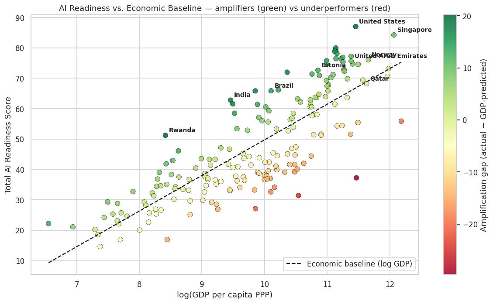

# Government AI Amplification: What Drives a Government's AI Readiness?

> A data-science investigation into what makes some governments more AI-ready than others — and where the UAE fits in the global picture.



---

## 1. Motivation

Governments around the world are racing to digitally transform — and artificial intelligence is the headline technology of that transformation. Some governments use AI to **amplify** existing capacity: faster public services, smarter regulation, better citizen interactions. Others struggle to translate digital ambition into measurable readiness.

This project asks five concrete questions about that uneven landscape:

1. **How does AI readiness vary across regions and income groups — and where does the UAE rank?**
2. **Which of the three pillars (Government, Technology Sector, Data & Infrastructure) most strongly differentiates the top performers from the rest?**
3. **Which countries "punch above their weight" — achieve more AI readiness than their economic baseline predicts?**
4. **Can we accurately predict a country's AI readiness from structural features (region, income, GDP)? How accurate is the model and which features matter most?**
5. **Creative scenario: If the UAE invested in lifting one specific pillar by a realistic amount, what would the model predict for its total readiness and global rank?**

The project follows the **CRISP-DM** process (Business Understanding → Data Understanding → Data Preparation → Modeling → Evaluation → Deployment) end-to-end, all in a single annotated Jupyter notebook.

---

## 2. Libraries used

- `python` 3.11+
- `pandas` — data manipulation
- `numpy` — numerical operations
- `scikit-learn` — preprocessing pipelines, Linear Regression, Ridge, Random Forest, Gradient Boosting, cross-validation, metrics
- `matplotlib` — base plotting
- `seaborn` — statistical plots (boxplots, heatmaps)
- `jupyter` / `nbconvert` — notebook environment

Install everything with:

```bash
pip install pandas numpy scikit-learn matplotlib seaborn jupyter
```

---

## 3. Repository contents

```
government_ai_amplification/
├── README.md                              # This file
├── data/
│   ├── ai_readiness_2024.csv              # Oxford Insights Government AI Readiness
│   │                                       # Index 2024 — 188 countries × 4 scores
│   ├── country_enrichment.csv             # Region, World Bank income group, GDP
│   │                                       # per capita (PPP) for the same 188 countries
│   └── build_enrichment.py                # Reproducible script that builds
│                                           # country_enrichment.csv from a documented
│                                           # in-script table; cite-able and re-runnable
├── notebooks/
│   └── government_ai_amplification.ipynb  # Main analysis notebook (CRISP-DM)
├── outputs/
│   ├── 01_distributions.png               # Distribution of target + pillar boxplots
│   ├── 02_correlation.png                 # Numeric-feature correlation heatmap
│   ├── 03_region_income.png               # Readiness by region and income group
│   ├── 04_pillar_gap.png                  # Top-10 vs Bottom-10 pillar comparison
│   ├── 05_amplification_gap.png           # Scatter of readiness vs log(GDP)
│   │                                       # coloured by amplification residual
│   ├── 06_baseline_importance.png         # Random Forest feature importance
│   └── 07_uae_scenarios.png               # Counterfactual scenarios for the UAE
└── blog/
    └── blog_post.md                       # Non-technical blog post for general readers
```

---

## 4. Summary of results

### Question 1 — How does AI readiness vary by region and income?
North America (avg 82.6) leads, followed by Western Europe (69.6). Sub-Saharan Africa (32.7) trails. Income group is an even stronger predictor than region — high-income countries average ~65 vs low-income at ~26. **The UAE sits at rank 15 globally (75.66) — the highest in the MENA region**, ahead of Israel (74.52) and Saudi Arabia (72.36).

### Question 2 — Which pillar most differentiates the top performers?
All three pillars show large gaps between top-10 and bottom-10, but **the Government pillar shows the widest gap (~67 points)**. The implication: vision, ethics, digital capacity, and adaptability *within government itself* — not the size of the national tech sector — is the strongest differentiator of AI readiness. Government leadership is the most accessible and fastest amplifier.

### Question 3 — Which countries punch above their economic weight?
GDP per capita alone explains roughly 68% of variance in readiness. The remaining ~32% is "amplification headroom." Top amplifiers include the **United States, Rwanda, India, China, Indonesia, Jordan, Republic of Korea, France, United Kingdom, and Brazil** — a mix of frontier economies *and* strategic emerging economies that have invested in national AI policy beyond what their economic baseline would predict.

### Question 4 — How accurately can we predict AI readiness?
Using only region, income group, and log(GDP per capita), we achieve **R² ≈ 0.72** (5-fold cross-validated) with **MAE ≈ 7** points on a 0–100 scale. Linear and Ridge regressions slightly outperform Random Forest and Gradient Boosting because the underlying log(GDP) → readiness relationship is close to linear. Adding the three pillar scores trivially pushes R² toward 1.0 (the total is the arithmetic mean of the pillars by construction).

### Question 5 — UAE counterfactual scenarios
The full model (pillars + economic context) was used to run counterfactuals for the UAE:

| Scenario | Predicted Total | Hypothetical Rank |
|----------|----------------:|------------------:|
| Status quo                                | 75.6 | #13 |
| +5 to Government pillar                   | 78.2 | #6  |
| +5 to Technology Sector pillar            | 76.5 | #10 |
| +5 to Data & Infrastructure pillar        | 76.5 | #9  |
| +5 to ALL three pillars                   | 79.9 | #4  |
| Match Singapore's Tech Sector (+9.45)     | 79.5 | #4  |

**Key insight:** A coordinated +5 across all three pillars lifts the UAE from rank ~13 into the global **top 5**. The Tech Sector is the UAE's weakest pillar (59.20) and has the largest absolute headroom; the Government pillar is already strong but has the highest model-predicted marginal lift because top performers all sit above 84 on it. The realistic strategy combines *protect-and-extend* on Government / Data Infrastructure with *targeted catch-up* on Tech Sector.

---

## 5. How to reproduce

1. Clone the repository.
2. Install dependencies (see Libraries section above).
3. Open `notebooks/government_ai_amplification.ipynb` in Jupyter and run all cells. Total runtime: ~30 seconds. All figures will be regenerated into `outputs/`.

The notebook is fully self-contained — no API keys, no network calls at runtime, no manual downloads. The data files in `data/` are committed to the repository and are the only inputs.

---

## 6. Data sources and acknowledgments

- **Oxford Insights Government AI Readiness Index 2024.** Published December 2024 by Oxford Insights under a Creative Commons Attribution-ShareAlike 4.0 International licence. Country-level pillar scores (Government, Technology Sector, Data & Infrastructure) and total scores were extracted from the report's Annex II ("Full rankings") for 188 countries.
- **World Bank country and lending groups, FY24.** Country-level income classification (Low / Lower middle / Upper middle / High income).
- **IMF World Economic Outlook (April 2026).** GDP per capita PPP estimates, retrieved via the Wikipedia consolidated list ("List of countries by GDP (PPP) per capita") on 21 May 2026.
- **Regional groupings** were taken from the regional sections of the Oxford Insights 2024 report itself (North America, Western Europe, Eastern Europe, East Asia, Middle East & North Africa, South & Central Asia, Latin America & Caribbean, Pacific, Sub-Saharan Africa).

This project is an independent academic / educational analysis of public data and is **not** affiliated with, endorsed by, or representative of Oxford Insights, the World Bank, the IMF, or any government entity.

---

## 7. Author and licence

**Author:** Mohamed Sultan Albadi Aldhaheri  
Master of Science in Professional Studies: Data Analytics (RIT Dubai, Spring 2026)

Submitted in fulfilment of the Udacity Data Science Nanodegree project *"Write a Data Science Blog Post."*

Code is released under the MIT Licence. Underlying data sources retain their respective licences (CC BY-SA 4.0 for the Oxford Insights report; other sources as cited above).
