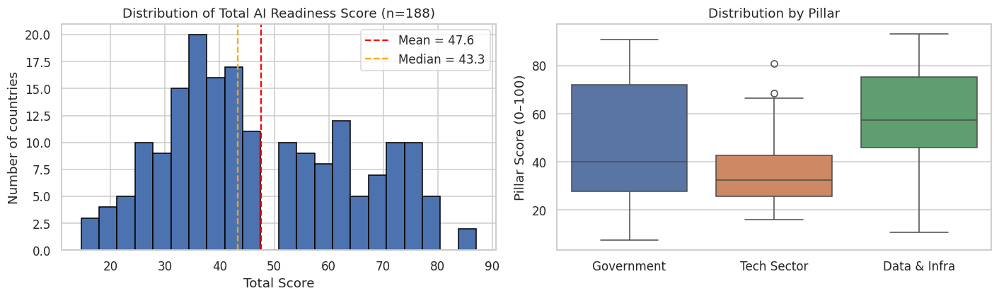
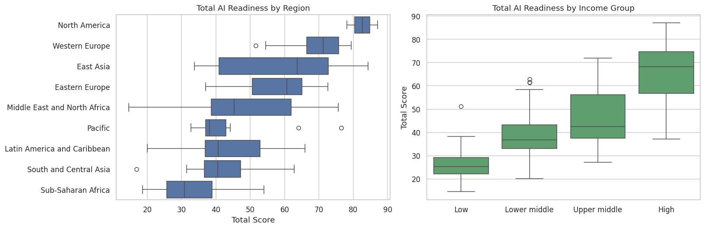
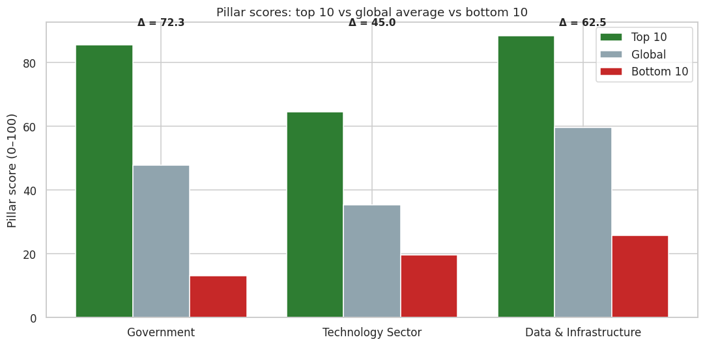
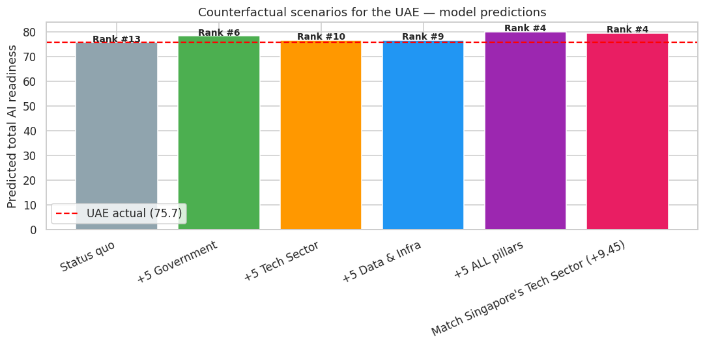

# How Ready is Your Government for AI? — and What it Would Take to Move Up

*A look at 188 countries through the lens of one of the world's most-watched AI readiness rankings, and a thought experiment about the UAE.*

---

## Why this matters

Walk into any government office today and you'll hear the same conversation. *We need to use AI. We need to digitally transform. We need to be more efficient, more responsive, more data-driven.* Every minister has a slide deck. Every ministry has a strategy.

But how would you actually **measure** whether a government is ready for AI? Not "is the country rich" — that's easy. Something more specific: does the government have the right *vision*, the right *people*, the right *infrastructure*, and the right *ethical guardrails* to actually use this technology to serve citizens?

Oxford Insights publishes exactly that measurement. Their Government AI Readiness Index scores 188 countries on a 0–100 scale, breaking each country's readiness down into three pillars: the **government itself** (vision, ethics, digital capacity), the **technology sector** (the supply of AI tools and talent), and **data and infrastructure** (the raw fuel of AI systems).

In this post I'll walk through what 188 governments look like through this lens, identify the countries that punch above their economic weight, and run a thought experiment: if the UAE — currently 15th globally — wanted to break into the global top 5, what would it actually take?

---

## What the data looks like

The dataset is small and clean: 188 rows (countries), four numbers per country (total + three pillars), plus three context variables I added — region, World Bank income group, and GDP per capita.

The first thing that jumps out is the **Technology Sector pillar**. Most countries score in the 20s and 30s on it, with a handful of frontier outliers — the US, China, the UK, France — pulling the high end. The Government and Data & Infrastructure pillars are much more uniformly distributed: most countries are somewhere in the middle, with a clear top tier and a clear bottom tier.

In plainer terms: **most governments aren't trying to build a national tech industry from scratch.** They're trying to build digital capacity inside government — and they're succeeding to varying degrees.

---

## Where does AI readiness cluster?

The pattern is exactly what you'd expect from any global indicator. North America leads (US 87, Canada 78). Western Europe is next. Sub-Saharan Africa is at the bottom, with most countries scoring in the 20s and 30s.

But notice something subtler: the **income gradient is sharper than the regional gradient**. Once you know whether a country is high-income or low-income, you've already explained a lot of where it sits. Region adds nuance — East Asia and Eastern Europe outperform their income levels — but income does most of the work.

The UAE sits **15th globally** with a score of 75.66, the highest in the MENA region. Israel (74.52) and Saudi Arabia (72.36) follow closely.

---

## The big finding: government leadership is the biggest differentiator

This was the most surprising result for me. I expected the Technology Sector pillar to be the thing that separates winners from losers — after all, isn't AI all about having a tech industry?

Not really.

When you compare the top 10 countries to the bottom 10, **the Government pillar shows the widest gap** — about 67 points. That's vision, ethics, regulation, accountability, and digital skills inside the public sector itself. The Tech Sector pillar shows a narrower gap, mostly because there's a handful of countries with enormous tech sectors (the US most obviously) and everyone else is bunched together.

What this means in practice: a country with a clear AI strategy, ethical guidelines, and digital skills in the civil service can rank highly *even without* hosting Silicon Valley. Estonia, Singapore, the Republic of Korea — none of these are "tech superpowers" in the way the US is. They're disciplined, government-led adopters of AI for public benefit.

This is the most encouraging finding for any middle-income or upper-middle-income country. The most expensive thing — building a frontier tech sector — is not the binding constraint. **The cheapest, fastest amplifiers are leadership decisions.**

---

## Which countries amplify beyond their economic weight?

Now the more interesting question: which countries do *more* with AI readiness than you'd predict from their economic size alone?

I fit a simple line through the data, with log(GDP per capita) on one axis and AI readiness on the other. The line explains roughly 68% of the variation. The other 32% — the gap between each country's actual score and where the line would put it — is real policy headroom. Call it the "amplification gap."

The top amplifiers — countries scoring at least ~15 points higher than their economic baseline predicts — fall into three clear groups:

**1. Strategic emerging economies.** Rwanda, India, Indonesia, Jordan. These are countries that have made AI a national priority and built strategies, ethics frameworks, and digital programmes despite modest GDP per capita.

**2. Compact high-capacity governments.** The Republic of Korea, Estonia. These are mid-sized economies that punch above their weight through disciplined, sustained digital-government investment over many years.

**3. Frontier economies still pushing.** The United States, China, France, United Kingdom. They were going to score high anyway, but they're scoring even higher than their (already high) GDP predicts — because their tech sectors and AI policy structures are unusually mature.

And the underperformers? Mostly **resource-rich countries without an active digital strategy**. Wealth alone doesn't deliver AI readiness; you have to choose to invest in it.

---

## How well can a model predict AI readiness?

This is where a bit of machine learning earns its keep. Using only three pieces of information about each country — region, income group, and log GDP per capita — I trained four different regression models (Linear, Ridge, Random Forest, Gradient Boosting) and asked them: can you predict the total AI readiness score?

The honest answer: **yes, but not perfectly**. The best models achieve an R² of about 0.72 — meaning they explain ~72% of the variance — with a typical error of around 7 points (out of 100). That's enough to confirm that structural factors matter a lot, but it also confirms that the remaining ~28% is genuinely about *what governments choose to do*.

This is the punchline of the project: even with very crude features, you can predict roughly where a country will land on AI readiness from its economic profile alone. The difference between sitting *on* that prediction and sitting *above* it is policy.

---

## A thought experiment: what would it take for the UAE to reach the global top 5?

Here's the fun part. The UAE today sits at 75.66, rank 15 globally. The top 5 starts around the high 70s and runs up to Singapore at 84.25. What investments would put the UAE there?

The UAE's three pillar scores are interesting:

- **Government pillar: 83.89** — already among the top 10 in the world on this dimension
- **Data & Infrastructure pillar: 83.89** — same story
- **Technology Sector pillar: 59.20** — this is where the UAE is furthest from the frontier

I used the full model to run six hypothetical scenarios, each representing a realistic 2-to-3-year policy push:

The pattern is clear:

- **Lifting all three pillars by +5 points** moves the UAE from rank #13 (model-predicted) into the global **top 5** — directly into the company of Singapore, the US, the Republic of Korea, and France.
- **Lifting just one pillar by +5** matters less. Each single-pillar uplift gets the UAE only a few rank places.
- **The Government pillar has the biggest single-pillar effect in the model** — a +5 there moves the UAE from #13 to #6 on its own. The model has learned that top performers all sit above 84 on Government, and crossing that threshold matters.
- **The Technology Sector has the most absolute headroom.** It's the UAE's weakest pillar, and matching Singapore's level on it (a realistic +9.45-point goal) puts the UAE in the same top-5 club.

The realistic policy interpretation is straightforward: **the UAE doesn't have to choose**. The story isn't "invest in Tech Sector *instead of* Government." It's "extend the Government and Data Infrastructure lead, while closing the Tech Sector gap." That's exactly the combined investment that the model predicts puts the UAE in the global top 5.

---

## So what does all this actually mean?

Three takeaways for anyone working on government digital transformation:

**1. Most of "where a country is" on AI readiness is set by economic structure — but not all of it.** About 32% is real policy headroom. That's a lot. Don't accept your baseline as destiny.

**2. The biggest differentiator between AI-ready and AI-laggard governments is not the size of the country's tech industry. It's what the government itself decides to do.** Vision, ethics, accountability, digital capacity within the civil service. These are leadership decisions that don't require building Silicon Valley.

**3. For middle-income and high-income countries with strong governance — the UAE being a clean example — the binding constraint is not government will. It's getting the tech sector to keep up.** That's an ecosystem problem: VC availability, AI talent, R&D spending, the kind of long-cycle investments that take a decade to fully mature.

The good news, if you're in one of the amplifier countries: you're already proving that policy choices matter more than economic determinism. The harder news: holding that position requires continuing to invest, year after year, in the deeply unglamorous foundations — civil servants who understand AI, procurement processes that can actually buy it, ethical frameworks that earn citizen trust.

That's not as headline-grabbing as a new AI lab launch. But it's what the data says actually moves the needle.

---

*The full analysis, including code, data, and reproducibility instructions, is available on [GitHub](#). This post is part of the Udacity Data Science Nanodegree.*

*Data sources: Oxford Insights Government AI Readiness Index 2024, IMF World Economic Outlook (April 2026), World Bank country income classifications. All analysis in Python using pandas, scikit-learn, matplotlib, and seaborn.*
